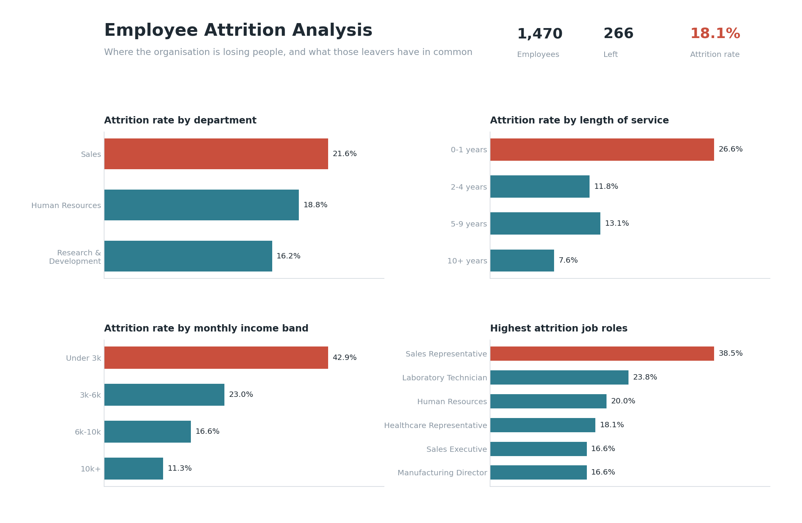

# HR Employee Attrition Analysis

SQL analysis of employee attrition, with a dashboard summarising the results.

**The question:** which parts of the organisation are losing people fastest, and do
the leavers have anything in common?



---

## The data

1,470 employee records covering department, job role, length of service, monthly
income, overtime, business travel, job satisfaction and whether the employee left.

Column names follow the widely used IBM HR Analytics Employee Attrition dataset, so
the same queries run unchanged against that CSV if you swap it in.

---

## What I found

**Overall attrition is 18.1%** — 266 of 1,470 employees left.

**1. Attrition is concentrated in the first year.**
Employees with 0–1 years of service leave at **26.6%**, against 11.8% for those with
2–4 years and 7.6% for those past ten years. The first year is more than three times
riskier than the long-tenured group. That points at recruitment fit and onboarding
rather than pay alone.

**2. Sales is the worst department, but the problem is narrower than that.**
Sales sits at 21.6% against 16.2% for R&D. Breaking it down by role shows it isn't the
whole department — **Sales Representative alone runs at 38.5%**, while Sales Manager is
at 9.3%. Treating this as a "Sales problem" would miss the point.

**3. Pay tracks attrition strongly at the bottom of the scale.**
The under-3k income band leaves at **42.9%**, falling to 23.0% at 3k–6k, 16.6% at
6k–10k and 11.3% above 10k. The effect is steepest at the lowest band, which overlaps
heavily with the Sales Representative role.

**4. Overtime and frequent travel compound each other.**
Employees who work overtime *and* travel frequently leave at **32.9%**, roughly double
the rate of those who do neither. Either factor alone is much milder.

**Where I'd look first:** early-tenure Sales Representatives on the lowest income band
who also work overtime. That group sits at the intersection of every factor above.

---

## How it works

Queries live in `/queries` and are numbered in the order they build on each other.

| File | What it answers |
|---|---|
| `01_overall_attrition.sql` | Baseline rate across the organisation |
| `02_attrition_by_department.sql` | Which departments lose the most people |
| `03_tenure_bands.sql` | When in someone's tenure they leave |
| `04_role_ranking.sql` | Which job roles are worst inside their own department |
| `05_income_bands.sql` | Whether pay explains who leaves |
| `06_overtime_and_travel.sql` | Working-conditions factors, side by side |

### The SQL, in plain terms

- **`CASE`** — if-then logic inside a query. Used here to turn the `Yes`/`No` attrition
  column into a 1/0 that can be added up, and to build the tenure and income bands.
- **`GROUP BY`** — collapses many rows into one summary row, e.g. one line per department.
- **CTE (the `WITH` block)** — a named temporary result you build first, then query. In
  `04_role_ranking.sql` the attrition rate per role is worked out first, then ranked.
  It keeps the query readable instead of nesting one query inside another.
- **Window functions** — a calculation across rows that *keeps every row visible*, unlike
  `GROUP BY`. `RANK() OVER (PARTITION BY Department ...)` ranks job roles within each
  department separately, and `AVG(...) OVER (PARTITION BY Department)` puts the department
  average next to each role so you can compare the two on the same line.

---

## Running it

```bash
python generate_data.py     # creates data/employees.csv
python run_analysis.py      # loads into SQLite, runs every query, prints results
python build_dashboard.py   # writes output/dashboard.png
```

Only `pandas`-free standard library plus `matplotlib` for the dashboard. SQLite is used
so there's nothing to install — the SQL is standard and runs in MySQL Workbench too.

---

## Files

```
hr-attrition-analysis/
├── README.md
├── generate_data.py        # builds the dataset
├── run_analysis.py         # loads data, runs all queries
├── build_dashboard.py      # builds the dashboard image
├── data/
│   └── employees.csv
├── queries/
│   ├── 01_overall_attrition.sql
│   ├── 02_attrition_by_department.sql
│   ├── 03_tenure_bands.sql
│   ├── 04_role_ranking.sql
│   ├── 05_income_bands.sql
│   └── 06_overtime_and_travel.sql
└── output/
    └── dashboard.png
```

---

## A note on the data

The dataset here is generated by `generate_data.py` rather than taken from a real
company — real HR records aren't public. The generator builds in realistic relationships
(early tenure, low pay, overtime and frequent travel all raise attrition risk), which is
what the analysis then recovers.

To run this against the public IBM HR Analytics dataset instead, download that CSV, save
it as `data/employees.csv`, and every query works unchanged.
