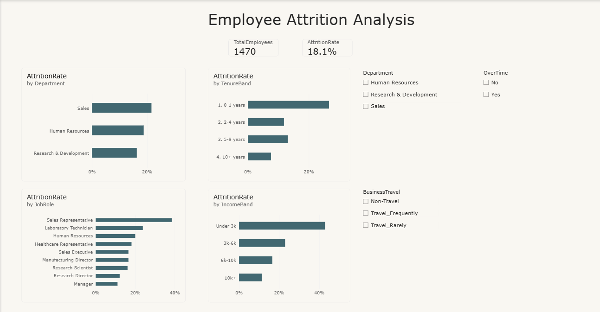

# HR Employee Attrition Analysis

SQL analysis of employee attrition, with a dashboard summarising the results.

**The question:** which parts of the organisation are losing people fastest, and do
the leavers have anything in common?

---

## The data

1,470 employee records covering department, job role, length of service, monthly
income, overtime, business travel, job satisfaction and whether the employee left.

This is the widely used IBM HR Analytics Employee Attrition dataset.

---

## What I found

[#what-i-found](#what-i-found)

**Overall attrition is 16.1%** — 237 of 1,470 employees left.

**1. Attrition is concentrated in the first year.** Employees with 0–1 years of service leave at **34.9%**, against 18.1% for those with
2–4 years, 11.1% for 5–9 years, and 10.4% past ten years. The first year is
roughly **3.4x** riskier than the long-tenured group. That points at
recruitment fit and onboarding rather than pay alone.

**2. Sales and HR run close together; R&D is the outlier.** Sales sits at 20.6%, HR close behind at 19.0%, R&D notably lower at
13.8%. Breaking it down by role shows the real driver — **Sales
Representative alone runs at 39.8%**, against a Sales department average of
20.9%. Laboratory Technician in R&D is a similar story: 23.9% against a
10.3% department average. Treating this as a department-level problem
misses where the risk actually sits.

**3. Pay tracks attrition strongly at the bottom of the scale.** The under-3k income band leaves at **28.6%**, falling to 12.7% at 3k–6k,
12.0% at 6k–10k, and 8.9% above 10k. The effect is steepest at the lowest
band, which overlaps heavily with the Sales Representative role.

**4. Overtime and frequent travel compound each other sharply.** Employees who work overtime *and* travel frequently leave at **41.9%**,
against just 4.3% for those doing neither — a gap of nearly **10x**. Either
factor alone is much milder.

**Where I'd look first:** early-tenure Sales Representatives on the lowest
income band who also work overtime and travel frequently. That group sits
at the intersection of every factor above.

---

## How it works

Queries live in `/queries` and are numbered in the order they build on each other.

| File | What it answers |
|---|---|
| `01_overall_attrition.sql` | Baseline rate across the organisation |
| `02_attrition_by_department.sql` | Which departments lose the most people |
| `03_tenure_bands.sql` | When in someone's tenure they leave |
| `04_role_ranking.sql` | Which job roles are worst inside their own department |
| `05_income_bands.sql` | Whether pay explains who leaves |
| `06_overtime_and_travel.sql` | Working-conditions factors, side by side |

### The SQL, in plain terms

- **`CASE`** — if-then logic inside a query. Used here to turn the `Yes`/`No` attrition
  column into a 1/0 that can be added up, and to build the tenure and income bands.
- **`GROUP BY`** — collapses many rows into one summary row, e.g. one line per department.
- **CTE (the `WITH` block)** — a named temporary result you build first, then query. In
  `04_role_ranking.sql` the attrition rate per role is worked out first, then ranked.
  It keeps the query readable instead of nesting one query inside another.
- **Window functions** — a calculation across rows that *keeps every row visible*, unlike
  `GROUP BY`. `RANK() OVER (PARTITION BY Department ...)` ranks job roles within each
  department separately, and `AVG(...) OVER (PARTITION BY Department)` puts the department
  average next to each role so you can compare the two on the same line.

---

## Running it
python run_analysis.py # loads into SQLite, runs every query, prints results
python build_dashboard.py # writes output/dashboard.png

---

## Files
hr-attrition-analysis/
├── README.md
├── run_analysis.py # loads data, runs all queries
├── build_dashboard.py # builds the dashboard image
├── data/
│ └── employees.csv
├── queries/
│ ├── 01_overall_attrition.sql
│ ├── 02_attrition_by_department.sql
│ ├── 03_tenure_bands.sql
│ ├── 04_role_ranking.sql
│ ├── 05_income_bands.sql
│ └── 06_overtime_and_travel.sql
└── output/
└── dashboard.png

### Power BI version

An interactive version of the same analysis, built in Power BI Desktop with slicers for department, overtime and business travel.

The .pbix file is in the repository root.

---

## Data source

[#data-source](#data-source)

Dataset: IBM HR Analytics Employee Attrition (Kaggle), 1,470 records, 35 features.
